Text can be **bold**, _italic_, ~~strikethrough~~ or `keyword`.

[Link to another page](./another-page.html).

There should be whitespace between paragraphs.

There should be whitespace between paragraphs. We recommend including a README, or a file with information about your project.

# Cybersecurity portfolio guide

1. Create your repository.
log into github and create your repository. you can do this by clicking the green book on your dashboard 

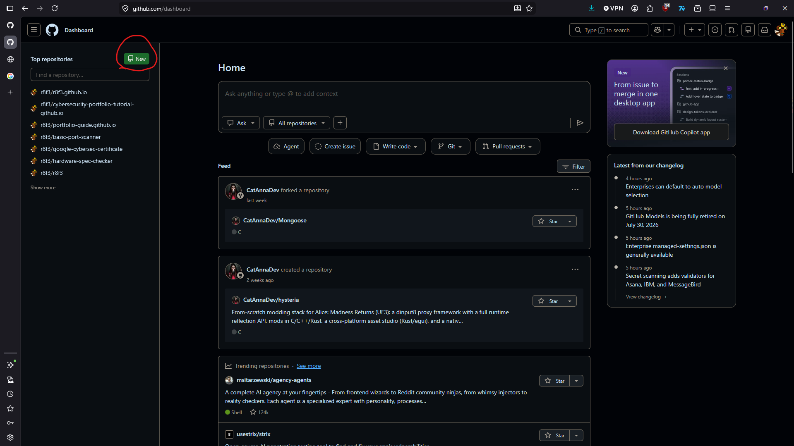

2. Name your repository.
The name of the repository will be the name of the website so keep that in mind. The repository also needs to end in github.io  
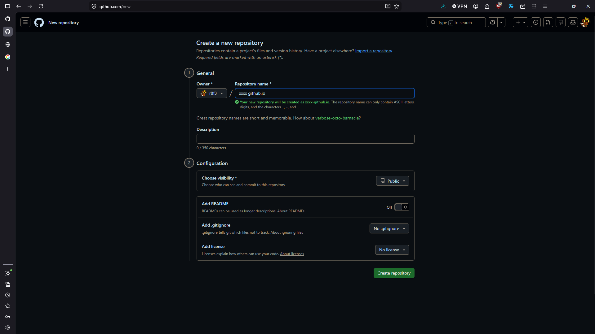

3. Create new file
Create a file to start your repository
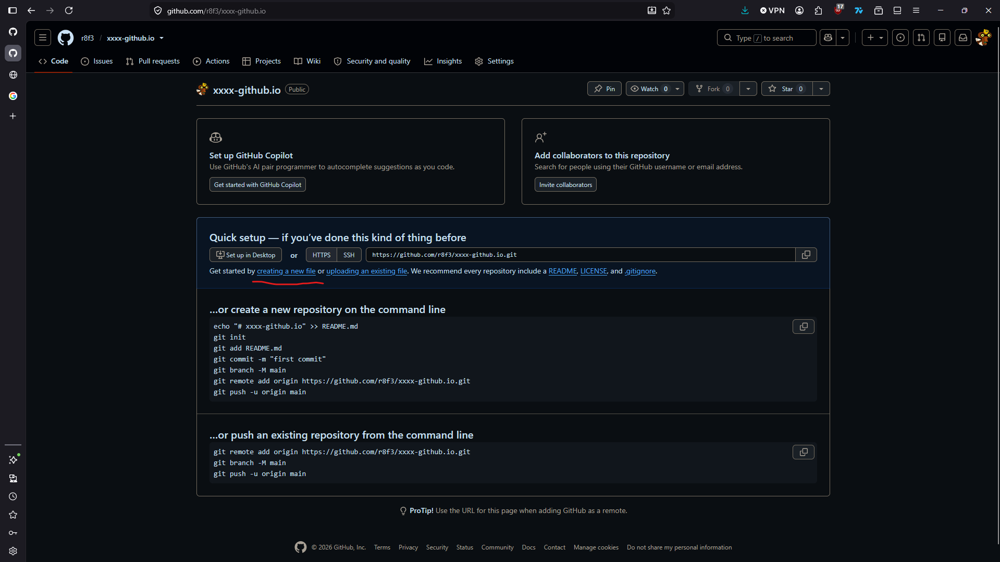

4. Index.html
Create a basic index.html file.(The naming is important). i have left the html requied down below to be copied
once you have entered the file click commit change 
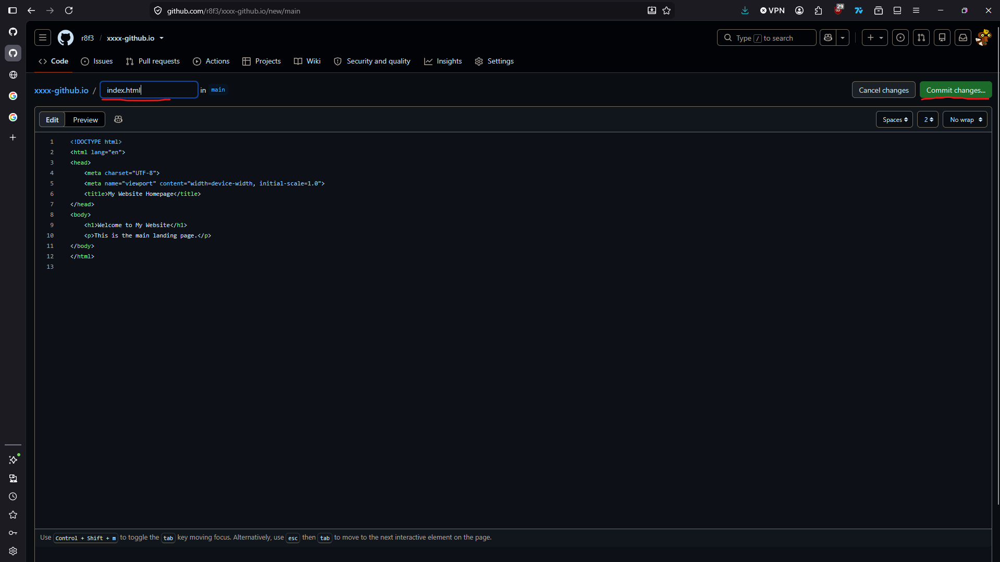
```html
// html code for index file
<!DOCTYPE html>
<html lang="en">
<head>
    <meta charset="UTF-8">
    <meta name="viewport" content="width=device-width, initial-scale=1.0">
    <title>My Website Homepage</title>
</head>
<body>
    <h1>Welcome to My Website</h1>
    <p>This is the main landing page.</p>
</body>
</html>
```

5. Navigate to settings
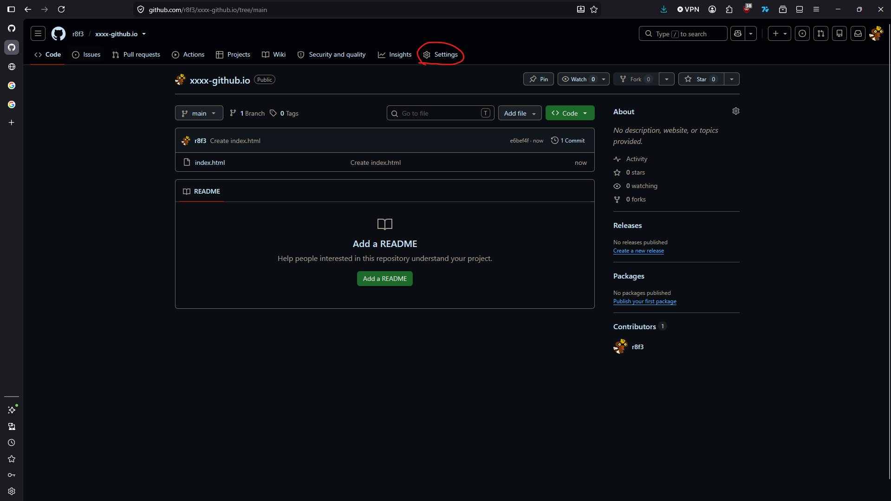

6. Navigate to pages
once you arrive at the pages part of settings we need to change the branch to the main branch.
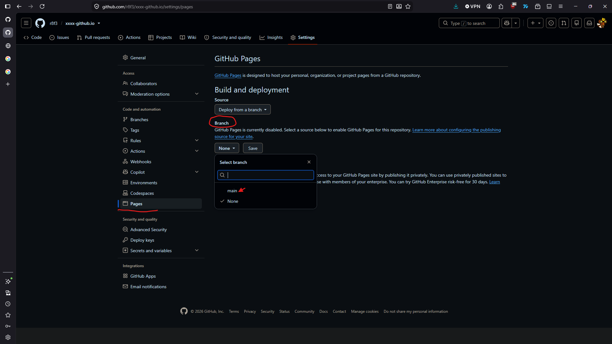


7. Testing the basic version of your website.
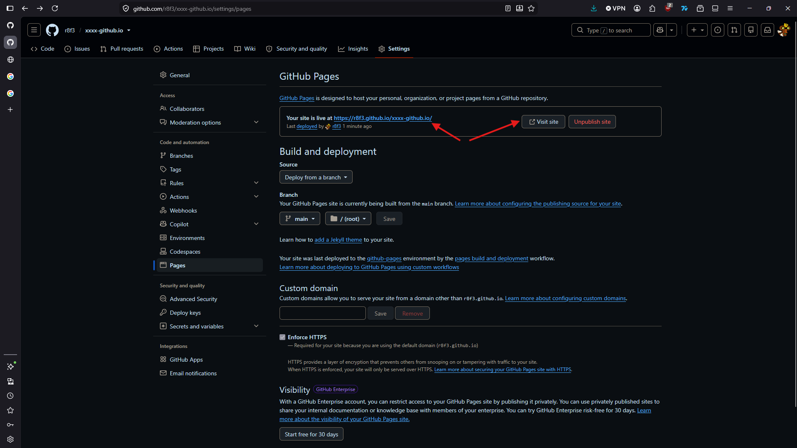

# Installing a theme

1. Click add jekyll theme 
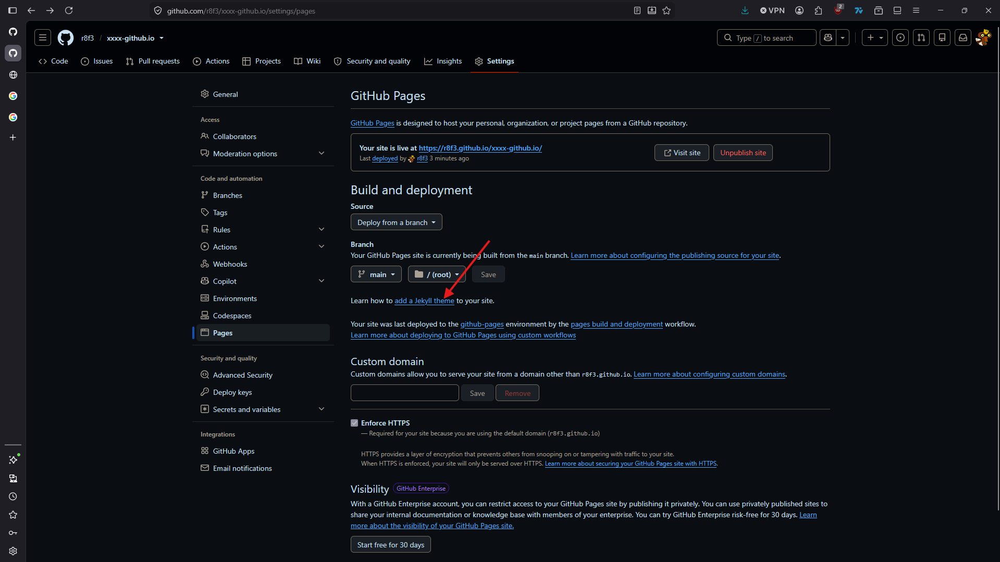


2. Scroll down to pick a theme and choose a theme fitting to you
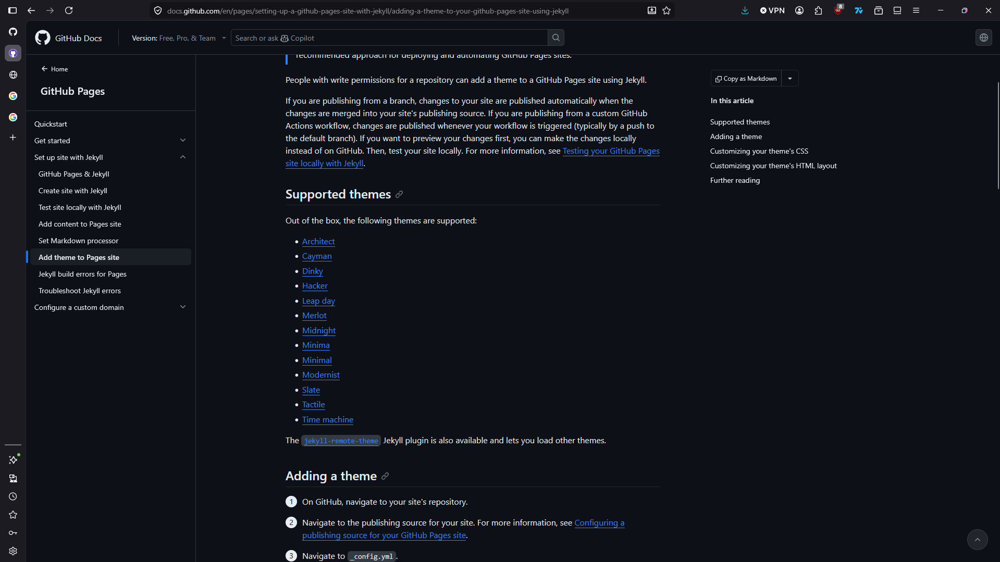

3. pick the theme you would like to use from the List.


4. There are 3 main files we need to download  (index.md, _config.yml and Gemfile)
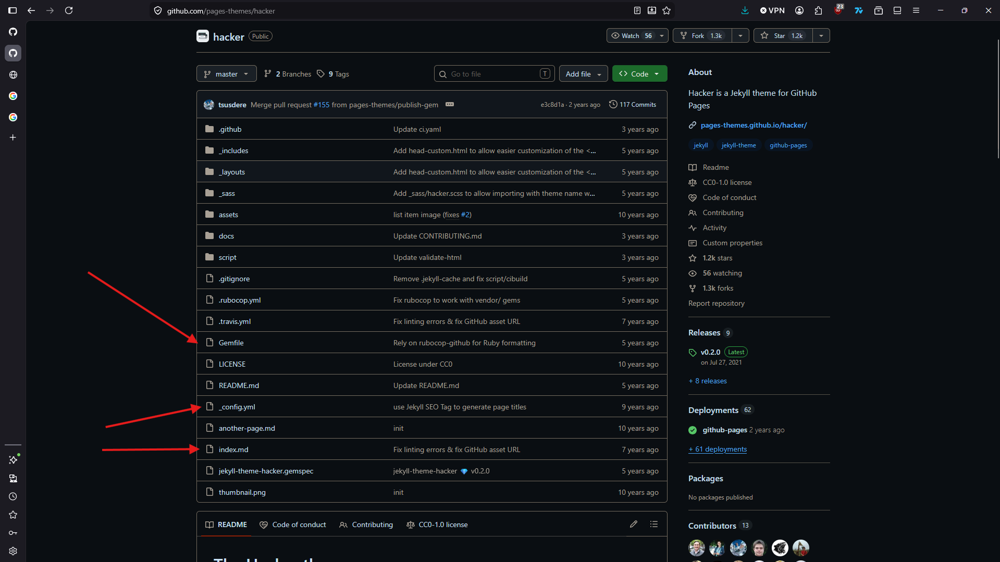

5. Downloading the files to do this click on the file > click the three dots > download
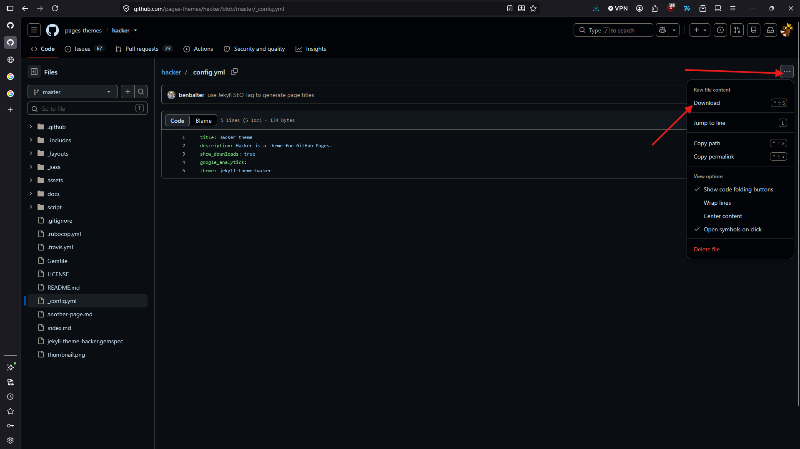

6. Return to your repo and delete the index.html file and upload the 3 files we downloaded 


#### Header 4

*   This is an unordered list following a header.
*   This is an unordered list following a header.
*   This is an unordered list following a header.

##### Header 5

1.  This is an ordered list following a header.
2.  This is an ordered list following a header.
3.  This is an ordered list following a header.

###### Header 6

| head1        | head two          | three |
|:-------------|:------------------|:------|
| ok           | good swedish fish | nice  |
| out of stock | good and plenty   | nice  |
| ok           | good `oreos`      | hmm   |
| ok           | good `zoute` drop | yumm  |

### There's a horizontal rule below this.

* * *

### Here is an unordered list:

*   Item foo
*   Item bar
*   Item baz
*   Item zip

### And an ordered list:

1.  Item one
1.  Item two
1.  Item three
1.  Item four

### And a nested list:

- level 1 item
  - level 2 item
  - level 2 item
    - level 3 item
    - level 3 item
- level 1 item
  - level 2 item
  - level 2 item
  - level 2 item
- level 1 item
  - level 2 item
  - level 2 item
- level 1 item

### Small image


### Large image

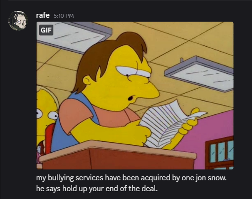


### Definition lists can be used with HTML syntax.

<dl>
<dt>Name</dt>
<dd>Godzilla</dd>
<dt>Born</dt>
<dd>1952</dd>
<dt>Birthplace</dt>
<dd>Japan</dd>
<dt>Color</dt>
<dd>Green</dd>
</dl>

```
Long, single-line code blocks should not wrap. They should horizontally scroll if they are too long. This line should be long enough to demonstrate this.
```

```
The final element.
```
